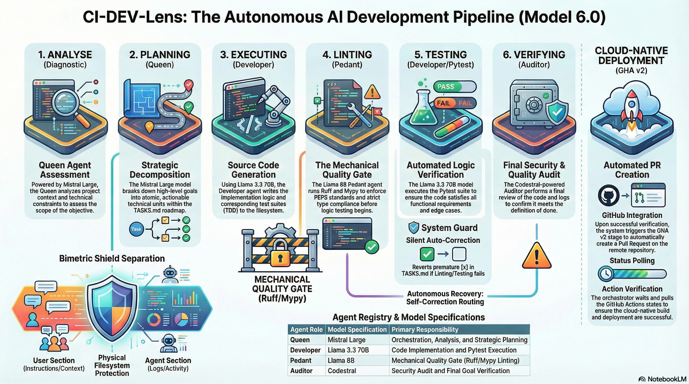
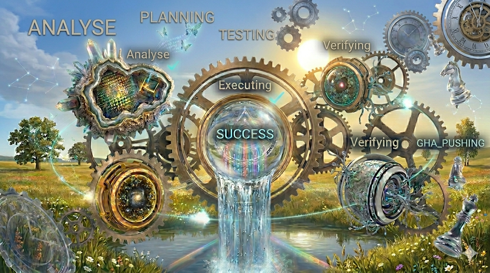

# 🚀 CI-DEV-Lens: Autonomous AI-Powered CI/CD Orchestrator for Python

<p align="center">
  <a href="https://github.com/OpenXFlow/ci-dev-lens">
    
  </a>
</p>

<p align="left">
  <strong>Deploy an autonomous swarm of AI agents to architect, implement, and audit your Python code with surgical precision.</strong>
  <br>
  CI-DEV-Lens is a professional-grade framework that bridges the gap between high-level human intent and low-level technical execution.
  <br>
  <em>Precision Vision. Autonomous Execution. Zero-Tolerance Quality.</em>
</p>

CI-DEV-Lens (Model 5.3) is not just another AI chat; it is a Managed State Machine. By employing a Hypervisor Pattern and Docker-based isolation, it coordinates specialized AI personas that physically interact with a sandboxed filesystem...

### ✨ Key Capabilities

-   🧠 **Sequential Multi-Stage Pipeline:** Orchestrates agents in a strictly ordered relay race (ANALYSE → PLANNING → EXECUTING → LINTING → TESTING → VERIFYING). This ensures context continuity and prevents logic fragmentation.
-   🔄 **Autonomous Feedback Loops:**  If a Quality Gate (Ruff, Mypy, or Pytest) fails, the system automatically routes raw error logs back to the responsible agent for immediate self-correction.
-   ☁️ **Cloud-Native Integration (GHA v2):** Seamless transition from local verification to automated cloud stages including branch management, **Automated PR Creation**, and remote **GitHub Actions status polling**.
-   🛡️ **Bimetric Isolation:** Strictly separates `[USER_SECTION]` instructions from `[AGENT_SECTION]` activity to ensure the AI never loses sight of human priorities.
-   ⚡ **API Resilience & Smart Fallback:** Native support for **Key Rotation** and automatic provider switching (e.g., failing over from Groq to Mistral during rate limits).
-   ⚙️ **Pydantic-Driven Architecture:** Entire system configuration and agent registries are validated by strict Pydantic V2 schemas for absolute reliability.
-   📉 **Smart Context Compression:** Integrated skills to prune activity logs and maximize token efficiency without losing critical project memory.
-   📦 **Hermetic Sandbox Execution:** The entire swarm operates within an isolated Docker environment. This ensures that autonomous agents have zero impact on your host system while providing a perfectly reproducible workspace for every run.

### 🛠️ Tech Stack & Integration

**Core Engine:**
-   **Python 3.12:** Leveraging modern type safety and performance.
-   **UV Manager:** Deterministic, lightning-fast dependency management.
-   **Pydantic V2:** The backbone of the Smart Parser and configuration layer.
-   **Rust (Phase 2):** Native performance modules for core logic (in development).

**Infrastructure:**
-   **Docker & Dev Containers:**  Standardized, zero-config environment. No more "it works on my machine"—the framework comes pre-packaged with all system dependencies, Python 3.12, and UV.

**Quality Gates:**
-   **Ruff (Tier 1):** Rust-powered mechanical linting and formatting.
-   **Mypy (Tier 2):** Strict logical type integrity enforcement.
-   **Pytest:** Unified testing for both the Kernel and the Application.

**Intelligence Providers:**
*The system supports any OpenAI-compatible API. The following are recommended for testing:*
-   **Groq API:** Blazing fast Llama 3.3 models for implementation (Free tier available).
-   **Mistral API:** High-reasoning models (Mistral Large, Codestral) for architecture and auditing (Free tier available).
-   **Other:** Fully compatible with Gemini, GitHub Models, or local LLMs (Ollama).

---

### 🚀 Quick Start for Engineers
1.  **Clone the Repository:**
    ```bash
    git clone https://github.com/OpenXFlow/ci-dev-lens.git
    cd ci-dev-lens
    ```
2.  **Wake the Swarm:**
    Initialize the environment and sync dependencies:
    ```bash
    make boot
    ```
3.  **Configure your "Fuel":**
    Open the generated `.env` file and add your API credentials:
    ```env
    GROQ_API_KEY=your_key_here
    MISTRAL_API_KEY=your_key_here
    ```
4.  **Set the Mission:**
    Edit `agent_context/TASKS.md` and define your goal in `## [USER_QUEUE]`.
5.  **Engage the Flow:**
    ```bash
    make pipeline
    ```

---

### 💡 Real-World Mission Example
Copy and paste this into your `agent_context/TASKS.md` to see the swarm in action:

```markdown
## [USER_QUEUE]
- [ ] GOAL-001: Build a secure FastAPI authentication module.
   - Requirement: Use 'passlib' with bcrypt for password hashing.
   - Requirement: Use 'python-jose' for JWT token generation and validation.
   - Requirement: Implement 'register' and 'login' (token) endpoints.
   - Requirement: Protect a sample '/me' endpoint using OAuth2PasswordBearer.
   - Requirement: 100% test coverage with pytest and FastAPI TestClient.
   - Requirement: Use a 'config.py' to load environment variables from .env via Pydantic Settings.
```
---

## 📚 Technical Documentation (Model 5.3)

| Resource | Description |
| :--- | :--- |
| [⚙️ Architecture](docs/ci_architecture/flow_diagrams_operations_map.md) | Visual architectural map |
| [🕹️ Terminal Interface](docs/TERMINAL_CMD.md) | Full guide to `make` commands (`boot`, `pipeline`, `mock`, `status`). |
| [⚙️ System Configuration](docs/CONFIGURATION.md) | Tuning `agent_orchestrator.json` and the Smart Parser. |
| [🖥️ User Interface](docs/USER_INTERFACE.md) | Understanding the Bimetric Markdown communication. |
| [🤖 Agent Personas](docs/AGENT_PERSONAS.md) | Defining the roles of Queen, Developer, Pedant, and Auditor. |
| [🏗️ Framework Development](docs/DEVELOPMENT_GUIDE.md) | How to add new Skills and extend the Kernel. |
| [⚙️ Framework Architecture](docs/ARCHITECTURE.md) | Deep dive into the State Machine and Hypervisor pattern. |
####  ⚡ For more details, see docs/quick_ref_for_users/...

## Contributing

We welcome contributions to the Core Hypervisor and the Agent Skill-set. Please see the [Development Guide](docs/DEVELOPMENT_GUIDE.md).

## License

This project is licensed under the **MIT License** - see the [LICENSE.md](LICENSE.md) file for details.

<p align="center">
  <a href="https://github.com/OpenXFlow/ci-dev-lens">
    
  </a>
</p>
