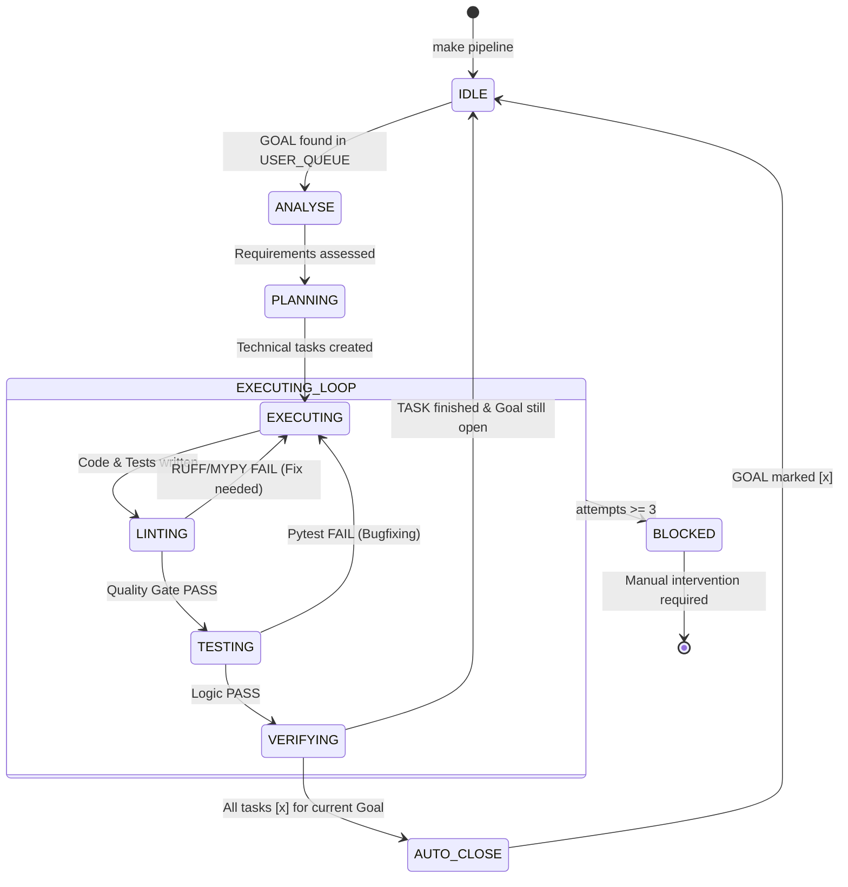
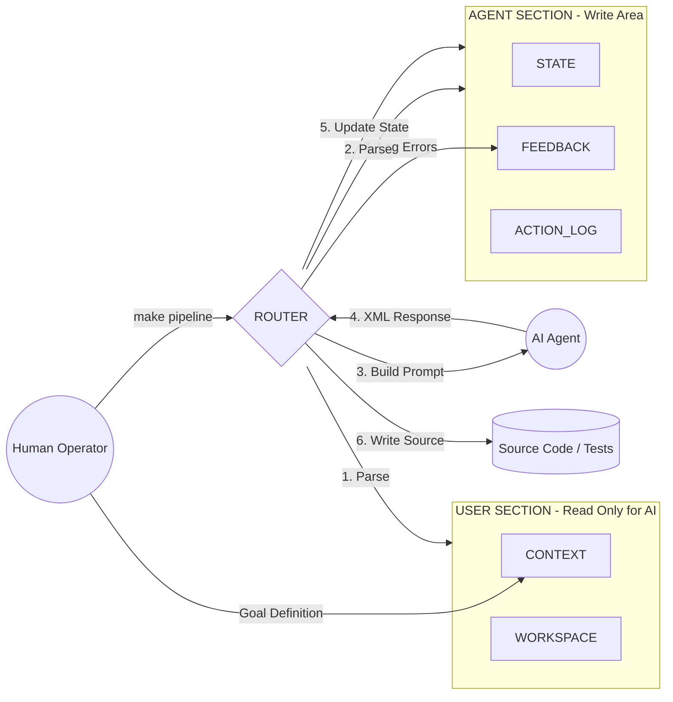
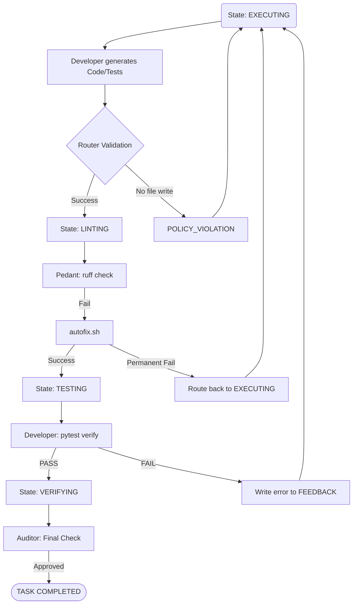
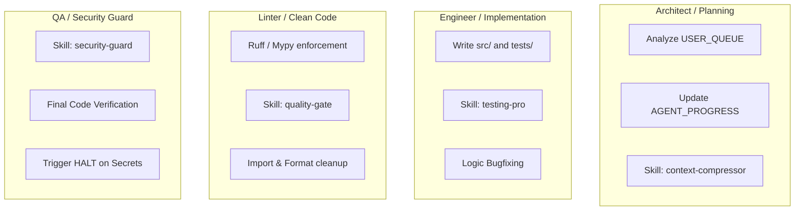

This document serves as the visual architectural map for **Agent-CI-Lens (Model 5.3)**. Using Mermaid diagrams, it explains how the orchestrator (Router) manages the information flow, system state transitions, and autonomous error correction.

---

# 🗺️ Architectural Flow & Operations Map

## 1. Primary System Lifecycle (State Machine)
This diagram illustrates the path from the user defining a Goal to its autonomous completion and auto-closure.

---

## 2. Bimetric Communication (Data Flow)
The Router acts as a "Hypervisor," isolating the User from the AI Agents. Agents never interact with raw files directly; they only see the context prepared by the Router.

---

## 3. Autonomous Self-Correction Flow
This diagram details the internal logic when a Developer makes a coding error that is caught by the Linter (Pedant) or the Test Suite (Pytest).

---

## 4. Agent Responsibility & Skill Matrix
A mapping of which agent controls which tools (Skills) and which parts of the system they are permitted to modify.

---

## 5. Diagram Legend

| Symbol | Meaning |
| :--- | :--- |
| **Rectangular Block** | An Action or a State (e.g., PLANNING). |
| **Diamond Shape** | Decision Point (e.g., Did tests pass?). |
| **Layered Block** | Sub-process or internal loop (e.g., Execution cycle). |
| **Dashed Line** | Feedback loop triggered by an error. |
| **Green Icon/Border** | Successful completion (Success). |
| **Red Icon/Border** | Failure or System Lock (Blocked/Halt). |

---

### How to use these diagrams during development:
1.  **Modifying `engine.py`:** Refer to **Diagram 1** to see where to insert new states or transition logic.
2.  **Modifying `managers.py`:** Refer to **Diagram 2** to ensure bimetric separation (User vs. Agent) is maintained.
3.  **Debugging Pipeline Failures:** Refer to **Diagram 3** to understand why the system might be "reverting" to a previous state during a run.