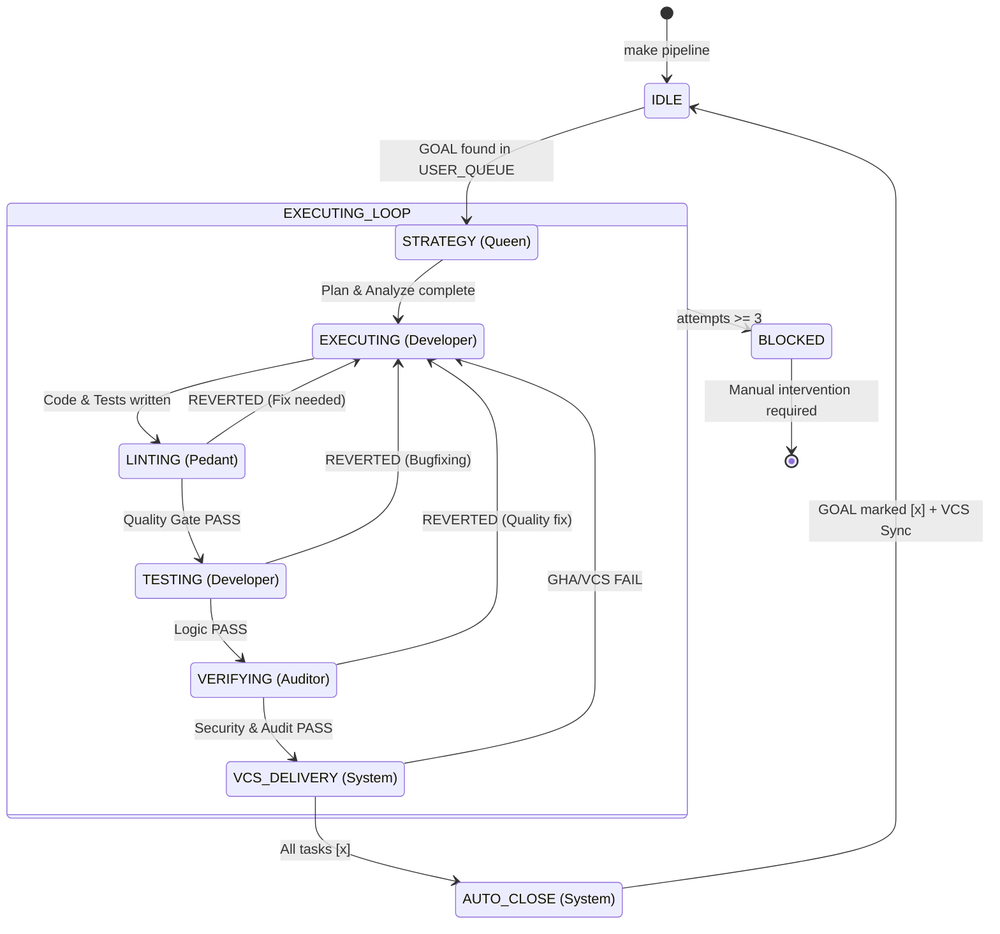
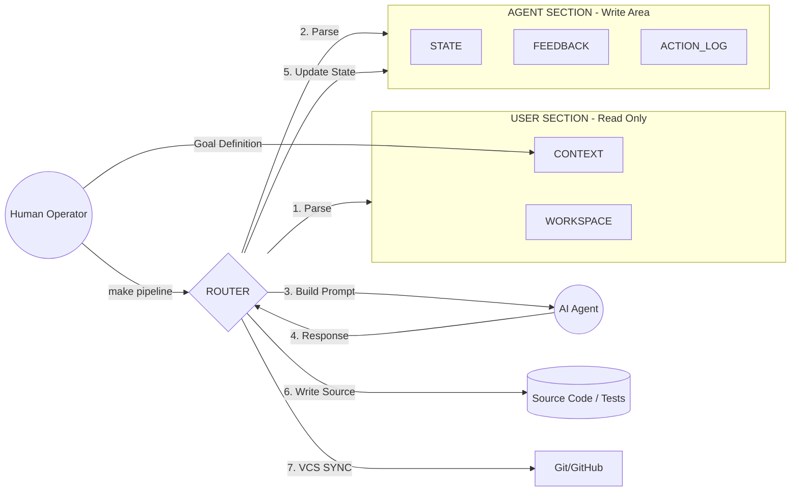
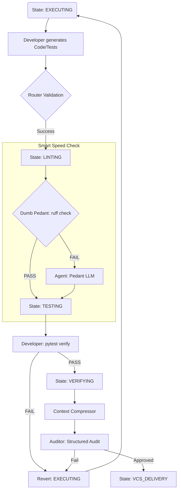
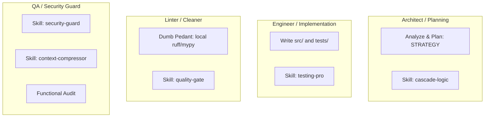
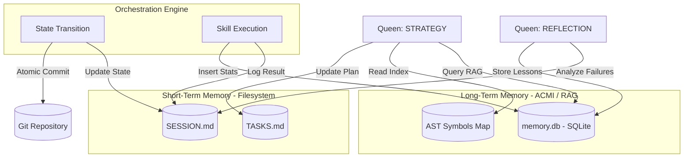

This document serves as the visual architectural map for **Agent-CI-Lens (Model 6.0)**. Using Mermaid diagrams, it explains how the orchestrator (Router) manages the information flow, system state transitions, and autonomous error correction with "Smart Speed" optimizations.

---

# 🗺️ Architectural Flow & Operations Map

## 1. Primary System Lifecycle (State Machine)
This diagram illustrates the path from the user defining a Goal to its autonomous completion, including the merged STRATEGY phase and final VCS synchronization.

### 1. The Queen: Strategy & Architecture (The Mastermind)
The Queen is the high-level strategist. She does not touch application code; instead, she governs the project's technical roadmap and ensures the swarm stays on track.

*   **STRATEGY State:** In Model 6.0, the Queen performs both **Analysis** and **Planning** in a single merged phase. She assesses the codebase map, identifies dependencies, and outlines the technical approach.
*   **Chain-of-Thought (CoT):** Using a structured reasoning process (stored in the `thought` field), she verifies if a requirement is feasible and which files must be modified before any work begins.
*   **Decomposition Logic:** She is responsible for breaking down a human-defined **GOAL** into a maximum of 5 atomic, verifiable **TASKS**. 
*   **History Protection:** The Queen is strictly forbidden from deleting task history. If the Router detects a `History Violation` (missing task IDs), it forces the Queen to re-plan while respecting past progress.

### 2. The Developer: Logic & Implementation (TDD Owner)
Following the **Test-Driven Development (TDD)** methodology strictly enforced in this project, the Developer is responsible for both writing the logic and proving that it works.

*   **EXECUTING State:** The Developer drafts the application logic in `src/` and simultaneously writes the corresponding tests in `tests/`.
*   **TESTING State:** The same Developer (utilizing the same context) runs the `pytest` suite.
*   **Self-Correction Loop:** If the **LOGIC** fails (e.g., `AssertionError`, `RuntimeError`, or failing tests), the Developer "returns the work to themselves." The Router performs a rollback to the `EXECUTING` state so the Developer can fix the bugs identified in the `TESTING` phase.

### 3. The Pedant: Style & Formatting (The Cleaner)
The Pedant does not care if the code works; they care if the code is **clean and compliant** with Python standards.

*   **LINTING State:** The Pedant (after the "Dumb Pedant" local pre-check) verifies the code against `ruff` and `mypy`.
*   **Feedback loop:** If the **STYLE** fails (e.g., messy imports, PEP8 violations, or missing type hints), the Pedant reverts the task back to the Developer.
*   **Key Focus:** Code aesthetics, import sorting, and static type integrity.

### 4. The Auditor: Security & Standards (The Gatekeeper)
The Auditor is the final high-level defense. They ensure the code isn't just functional and pretty, but also **safe and professional**.

*   **VERIFYING State:** The Auditor performs a functional and security audit after the context has been compressed.
*   **Feedback loop:** If **SECURITY or STANDARDS** fail (e.g., hardcoded API keys/secrets, missing Google Style docstrings, or a fundamental misunderstanding of the human Goal), the Auditor rejects the task.
*   **Key Focus:** Secret detection, documentation quality, and ensuring the final output matches the user requirements in `TASKS.md`.

---

## 2. Bimetric Communication & VCS Sync (Data Flow)
The Router acts as a "Hypervisor," isolating the User from AI Agents. All state updates are now atomically synced to Git.

---

## 3. Autonomous Self-Correction & "Smart Speed" Flow
This diagram details the optimized internal logic, including "Dumb Pedant" pre-checks and "Targeted Pre-flight Compression" before Auditing.

---

## 4. Agent Responsibility & Skill Matrix
Updated roles for the Model 6.0 architecture, focusing on atomic, high-performance execution.

---

## 5. Memory & RAG Persistence Layer

####  This layer implements a Tiered Memory architecture:
Markdown files (STM) provide immediate context for humans and agents, while the SQLite database (ACMI) stores deep project history and code signatures. 
#### 1. The Three Functional Layers
*   Orchestration Engine (The Processor):
*   Short-Term Memory - STM (The RAM):
*   Long-Term Memory - LTM/ACMI (The Database):

#### 2. Key Operational Flows (How to read the arrows)
*   The "High-Fidelity Mirroring" (Writing)
*   The RAG Loop (Retrieval-Augmented Generation)
*   The Reflection Loop (Self-Learning)

#### 3. Summary for the Operator
*   Human-Centric View: You stay in the **STM (Short-Term Memory)**. You write goals in `TASKS.md` and read logs in `SESSION.md`.
*   Machine-Centric View: The AI leverages the **LTM (Long-Term Memory)** to handle scale and complexity that humans don't need to see.

---

## 6. Diagram Legend

| Symbol | Meaning |
| :--- | :--- |
| **State** | A processing phase (e.g., STRATEGY). |
| **Diamond** | Decision gate (e.g., Pedant passed vs AI fallback). |
| **Dashed Line** | Feedback loop / Rollback to previous state. |
| **Sync Icon** | Atomicity point where VCS synchronization occurs. |

